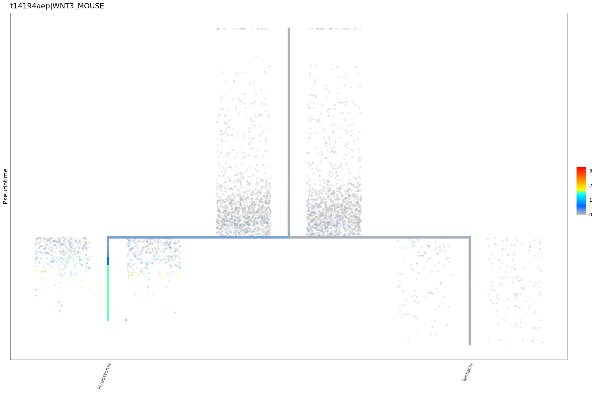

# Shedding light on unconventional opsin gene expression patterns in *Hydra vulgaris*

## Table of Contents:
* [Getting Started](#Getting)
    * [Loading Packages and Data](#Loading) 
* [Plotting Opsin Expression](#Plotting)
    * [**Figure 2** : Plotting expression across cell types in *Hydra*](#Fig2)
      * [**Figure 2** 0.1% expression cutoff example](#0.1)
      * [**Figure 2** 10% expression cutoff example](#10)
    * [**Figure 3**: Plotting expression across cell states in *Hydra*](#Fig3)
    * [**Figure 4**: Plotting expression body sections in *Hydra*](#Fig3)
    * [misc. gene expression tests in discussion](#misc)
        * [Phototransduction cascade](#phot)
        * [Wnt](#wnt)
* [Pulling Average Expression Values](#avg)
* [Pulling Metagene Scores](#met)

## Getting Started <a class="anchor" id="Getting"></a>

### Loading Packages and Data <a class="anchor" id="Loading"></a>
- I will warn that URD usually needs Seurat 2.3 not 5.2.1 and it was very difficult to get both to play nicely when generating the conda environment, there will be a yaml file in the repo but you may need to download some packages individually (see below)

- See Seurat site for installation: https://satijalab.org/seurat/articles/install.html \
source("https://z.umn.edu/archived-seurat") 

- Install URD using these instructions: https://github.com/farrellja/URD/blob/0fed8b824644288ba4ec405ddf82a36960e2d4f9/INSTALL.md \

- I needed to download some dependencies individually before downloading URD\
conda install -c conda-forge --solver=libmamba r-nloptr\
conda install -c conda-forge --solver=libmamba r-lme4\
conda install -c conda-forge --solver=libmamba r-pbkrtest\
conda install -c conda-forge --solver=libmamba r-car\
conda install -c conda-forge --solver=libmamba r-vim

- I used this command to download URD\
Rscript -e 'source("https://raw.githubusercontent.com/farrellja/URD/master/URD-Install.R")'


```R
#load packages
library("ggplot2") 
library("Matrix")
library("URD")
library ("Seurat")
library("repr")
```

    Registered S3 method overwritten by 'gplots':
      method         from 
      reorder.factor gdata
    
    Loading required package: SeuratObject
    
    Loading required package: sp
    
    
    Attaching package: ‘SeuratObject’
    
    
    The following objects are masked from ‘package:base’:
    
        intersect, t
    
    


```R
# CHANGE THIS TO REFLECT THE PATH WHERE YOU SAVED THE HYDRA DATA!
setwd("/kuhpc/scratch/cartwright/m026s156/hydrops/seibert_data")

# Define the output directory
output_dir <- "./output"

# Create it if it doesn't exist
if (!dir.exists(output_dir)) {
  dir.create(output_dir, recursive = TRUE)
}

# Load Hydra Transcriptome Object 
hydra <- readRDS("URD_analysis_objects/Hydra_Seurat_Whole_Transcriptome.rds")

# Load URD objects with trees (i.e. branching trajectories)
interstitial <- readRDS("URD_analysis_objects/Hydra_URD_IC.rds")
ectoderm <- readRDS("URD_analysis_objects/Hydra_URD_Ectoderm.rds")
endoderm <- readRDS("URD_analysis_objects/Hydra_URD_Endoderm.rds")

# Load URD objects without trees (i.e. linear trajectories)
male <- readRDS("URD_analysis_objects/Hydra_URD_MaleTranscriptome.rds")
granular.zymogen <- readRDS("URD_analysis_objects/Hydra_URD_GranularZymogen.rds")
spumous <- readRDS("URD_analysis_objects/Hydra_URD_SpumousMucous.rds")
 
# Load spline curve fits for visualizing gene expression
ectoderm.splines <- readRDS("URD_analysis_objects/Splines-Ectoderm.rds")
endoderm.splines <- readRDS("URD_analysis_objects/Splines-Endoderm.rds")
male.splines <- readRDS("URD_analysis_objects/Splines-MaleTranscriptome.rds")
granular.zymogen.splines <- readRDS("URD_analysis_objects/Splines-GranularZymogen.rds")
spumous.splines <- readRDS("URD_analysis_objects/Splines-SpumousMucous.rds")

#Loading metagene data
meta <- load("gene_regulation_data/Candidate_Regulators/Enrichment_Results/corResults.Rdata")
id_inventory <- read.delim("op3_id_inventory.txt")
```

## Plotting Opsin Expression <a class="anchor" id="Plotting"></a>

- This was adapted from the Plotting Hydra in URD tutorial from the Juliano Lab github: https://github.com/cejuliano/hydra_single_cell/blob/9d2dcb78155a616b22ae019b1c705d56738c1d38/URD_Hydra_Plotting_Tutorial.md

### find gene ID from URD objects
-  pulled transcript codes from hydra dataset using PIA
- *Note:'t31971aep' seems to not match any gene in the interstitial annotation*


```R
grep("t20729aep", rownames(interstitial@logupx.data), value=T)
grep("t20043aep", rownames(interstitial@logupx.data), value=T)
grep("t20044aep", rownames(interstitial@logupx.data), value=T)
grep("t29150aep", rownames(interstitial@logupx.data), value=T)
grep("t25412aep", rownames(interstitial@logupx.data), value=T)
grep("t3168aep", rownames(interstitial@logupx.data), value=T)
grep("t3233aep", rownames(interstitial@logupx.data), value=T)
grep("t32881aep", rownames(interstitial@logupx.data), value=T)
grep("t3169aep", rownames(interstitial@logupx.data), value=T)
grep("t21413aep", rownames(interstitial@logupx.data), value=T)
grep("t24564aep", rownames(interstitial@logupx.data), value=T)
grep("t31971aep", rownames(interstitial@logupx.data), value=T)
grep("t355aep", rownames(interstitial@logupx.data), value=T)
grep("t10575aep", rownames(interstitial@logupx.data), value=T)
grep("t24044aep", rownames(interstitial@logupx.data), value=T)
grep("t26793aep", rownames(interstitial@logupx.data), value=T)
grep("t9221aep", rownames(interstitial@logupx.data), value=T)
grep("t4885aep", rownames(interstitial@logupx.data), value=T)
grep("t15588aep", rownames(interstitial@logupx.data), value=T)
grep("t24989aep", rownames(interstitial@logupx.data), value=T)
grep("t27882aep", rownames(interstitial@logupx.data), value=T)
grep("t33805aep", rownames(interstitial@logupx.data), value=T)
grep("t37969aep", rownames(interstitial@logupx.data), value=T)
grep("t3337aep", rownames(interstitial@logupx.data), value=T)
grep("t36346aep", rownames(interstitial@logupx.data), value=T)
grep("t33516aep", rownames(interstitial@logupx.data), value=T)
grep("t33517aep", rownames(interstitial@logupx.data), value=T)
grep("t4602aep", rownames(interstitial@logupx.data), value=T)
grep("t26465aep", rownames(interstitial@logupx.data), value=T)
grep("t26466aep", rownames(interstitial@logupx.data), value=T)
grep("t29512aep", rownames(interstitial@logupx.data), value=T)
grep("t33568aep", rownames(interstitial@logupx.data), value=T)
grep("t14044aep", rownames(interstitial@logupx.data), value=T)
grep("t29959aep", rownames(interstitial@logupx.data), value=T)
grep("t17353aep", rownames(interstitial@logupx.data), value=T)
grep("t2106aep", rownames(interstitial@logupx.data), value=T)
grep("t21092aep", rownames(interstitial@logupx.data), value=T)
grep("t27688aep", rownames(interstitial@logupx.data), value=T)
grep("t36136aep", rownames(interstitial@logupx.data), value=T)
grep("t36280aep", rownames(interstitial@logupx.data), value=T)
grep("t4128aep", rownames(interstitial@logupx.data), value=T)
grep("t32850aep", rownames(interstitial@logupx.data), value=T)
grep("t31375aep", rownames(interstitial@logupx.data), value=T)
grep("t20210aep", rownames(interstitial@logupx.data), value=T)
grep("t16278aep", rownames(interstitial@logupx.data), value=T)
```


't20729aep|OPSP_COLLI'


't20043aep|OPSX_HUMAN'


't20044aep'


't29150aep|OPSX_HUMAN'


't25412aep|OPSO_SALSA'


't3168aep|OPN3_HUMAN'


't3233aep'


't32881aep|OPN3_MOUSE'


't3169aep|OPSX_HUMAN'


't21413aep|OPN4_PHOSU'


't24564aep|OPSR_CAPHI'


't31971aep'


't355aep|OPSG3_DANRE'


't10575aep|OPSR_BOVIN'


't24044aep|OPSP_ICTPU'


't26793aep|OPSO_RUTRU'


't9221aep|OPN3_HUMAN'


't4885aep|OPN5_MOUSE'


't15588aep|OPN3_HUMAN'


't27882aep|OPN3_HUMAN'


't33805aep|OPN4B_XENLA'


't37969aep|OPSD_ALLSU'


't3337aep'


't36346aep|OPN3_MOUSE'


't33516aep|OPSD2_MIZYE'


't33517aep|OPSD2_MIZYE'


't4602aep'


't26465aep|OPN3_HUMAN'


't26466aep|OPN3_HUMAN'


't29512aep|OPSP_CHICK'


't33568aep'


't14044aep|OPSD2_MIZYE'


't29959aep|OPN4B_XENLA'


't17353aep|OPN4B_XENLA'


't2106aep|OPN3_HUMAN'


't21092aep|OPSD_LOLFO'


't27688aep|OPSP_COLLI'


't36136aep|OPSD_LOLFO'


't36280aep|OPS2_DROPS'


't4128aep|OPSD2_MIZYE'


't32850aep'


't31375aep|OPSC1_HEMSA'


't20210aep'


't16278aep|OPSC2_HEMSA'


### **Figure 2** : Plotting expression across cell types in *Hydra* <a class="anchor" id="Fig2"></a>


```R
# updates V2 seurat object to V3 (changes | and _ to - in names)  
hydraV3 <- UpdateSeuratObject(hydra)

#get list of opsin
new.hydraV3.features <- c(
  "t20729aep-OPSP-COLLI", "t20043aep-OPSX-HUMAN", "t20044aep", "t29150aep-OPSX-HUMAN", "t25412aep-OPSO-SALSA",
  "t3168aep-OPN3-HUMAN", "t3233aep", "t32881aep-OPN3-MOUSE", "t3169aep-OPSX-HUMAN", "t21413aep-OPN4-PHOSU", 
  "t24564aep-OPSR-CAPHI", "t31971aep", "t355aep-OPSG3-DANRE", "t10575aep-OPSR-BOVIN", "t24044aep-OPSP-ICTPU", 
  "t26793aep-OPSO-RUTRU", "t9221aep-OPN3-HUMAN", "t4885aep-OPN5-MOUSE", "t15588aep-OPN3-HUMAN", "t27882aep-OPN3-HUMAN", 
  "t33805aep-OPN4B-XENLA", "t37969aep", "t3337aep", "t36346aep-OPN3-MOUSE", "t33516aep-OPSD2-MIZYE", "t33517aep-OPSD2-MIZYE", 
  "t4602aep", "t26465aep-OPN3-HUMAN", "t26466aep-OPN3-HUMAN", "t29512aep-OPSP-CHICK", "t33568aep", "t14044aep-OPSD2-MIZYE", 
  "t29959aep-OPN4B-XENLA", "t17353aep-OPN4B-XENLA", "t2106aep-OPN3-HUMAN", "t21092aep-OPSD-LOLFO", "t27688aep-OPSP-COLLI", 
  "t36136aep-OPSD-LOLFO", "t36280aep-OPS2-DROPS", "t4128aep-OPSD2-MIZYE", "t31375aep-OPSC1-HEMSA", "t20210aep", "t16278aep-OPSC2-HEMSA",
  "t24989aep", "t32850aep"
)

#To reorder cluster ID's for better readability
#Get the Orders:
#current_levels <- levels(hydraV3)
#print(current_levels)                    

#make new order
new_order <- c(
  "ecEp_stem_cell", "ecEp-nb(pd)", "ecEp-nem(id)", "ecEp_basal_disk", "ecEp_head",
  "ecEp_battery_cell1(mp)", "ecEp_battery_cell2(mp)", "enEp_stem_cell", "enEp-nb(pd)",
  "enEp-nem(pd)", "enEp_tent-nem(pd)", "enEp_foot", "enEp_head", "enEp_tentacle",
  "i_stem_cell/progenitor", "i_nematocyte", "i_nb1", "i_nb2", "i_nb3", "i_nb4", "i_nb5",
  "i_granular_mucous_gland_cell", "i_spumous_mucous_gland_cell", "i_zymogen_gland_cell",
  "i_male_germline", "i_female_germline1", "i_female_germline2_nurse",
  "i_neuron/gland_cell_progenitor", "i_neuron_progenitor", "i_neuron_ec1", "i_neuron_ec2",
  "i_neuron_ec3", "i_neuron_ec4", "i_neuron_ec5", "i_neuron_en1", "i_neuron_en2",
  "i_neuron_en3", "db")

#reassign new order to hydra V3
levels(hydraV3) <- new_order
```

    Updating from v2.X to v3.X
    
    Warning message:
    “Not validating Assay objects”
    Warning message:
    “Not validating Assay objects”
    Warning message:
    “Not validating DimReduc objects”
    Warning message:
    “Not validating DimReduc objects”
    Warning message:
    “Not validating DimReduc objects”
    Warning message:
    “Not validating DimReduc objects”
    Warning message:
    “Not validating Seurat objects”
    Warning message:
    “Not validating Seurat objects”
    Warning message:
    “Not validating Seurat objects”
    Validating object structure
    
    Updating object slots
    
    Ensuring keys are in the proper structure
    
    Updating matrix keys for DimReduc ‘pca’
    
    Updating matrix keys for DimReduc ‘tsne’
    
    Ensuring keys are in the proper structure
    
    Ensuring feature names don't have underscores or pipes
    
    Warning message:
    “Not all features provided are in this Assay object, removing the following feature(s): t34446aep|VIAAT-XENLA, t35904aep|DDAC-ENTAG, t31833aep|BP10-PARLI, t38117aep|SAXO1-RAT, t35860aep|KIF3A-MACFA, t35863aep|SSPO-CHICK, t32307aep|NCAN-PANTR, t35991aep|FLNC-RAT, t31844aep|TLL1-DANRE, t31227aep|SYCP2-RAT, t37814aep|CC105-BOVIN, t32265aep|SYD1-CAEEL, t32266aep|GGT1-PIG, t32263aep|IF172-DANRE, t33696aep|CNRP1-BOVIN, t35853aep|TM175-MOUSE, t35850aep|CYTA-MOUSE, t37320aep|CO6A6-HUMAN, t32616aep|FBN1-BOVIN, t32412aep|M3K19-HUMAN, t32413aep|NTPES-BACSU, t36940aep|ROP1L-XENLA, t36938aep|SYT15-HUMAN, t31713aep|TBA-NOTVI, t37623aep|RHES-HUMAN, t36574aep|OPN4B-XENLA, t36585aep|CALM-MACPY, t38683aep|H10A-XENLA, t38674aep|S7A14-HUMAN, t32852aep|NPC2-DROME, t36486aep|SCN1-HETBL, t34600aep|KPSH1-BOVIN, t32785aep|HEBP1-MOUSE, t36257aep|EDIL3-MOUSE, t38455aep|PDE11-DROME, t31915aep|F149A-MOUSE, t34560aep|AMPN-RAT, t35296aep|MORN2-BOVIN, t31908aep|RSLBA-HUMAN, t31899aep|AT1A-HYDVU, t34195aep|SAM9L-HUMAN, t34183aep|TLN1-HUMAN, t32775aep|CELR2-HUMAN, t33155aep|CBPD-LOPSP, t36928aep|CACB2-RABIT, t35006aep|CER1-HUMAN, t36031aep|ANPRA-MOUSE, t34090aep|MYLK-RABIT, t32136aep|ZDH11-MOUSE, t32151aep|HE-PARLI, t38447aep|SAX-LITCT, t34475aep|LRIG2-HUMAN, t37718aep|CFA45-HUMAN, t37723aep|INTU-BOVIN, t32514aep|NPHP1-CANLF, t36994aep|KINH-SYNRA, t35151aep|ACTP1-ANTAS, t35152aep|ACTP1-ANTAS, t37988aep|GLNA-PANAR, t33783aep|GRM3-MOUSE, t31950aep|B3GN2-HUMAN, t31935aep|AP4S1-HUMAN, t31942aep|ECE1-CAVPO, t32744aep|LMX1A-HUMAN, t33595aep|FLT3-HUMAN, t38581aep|HE-HEMPU, t38586aep|KCNB1-PIG, t38428aep|SIX6-HUMAN, t38432aep|MYO3B-HUMAN, t38498aep|MARH1-HUMAN, t33119aep|KINH-STRPU, t36612aep|ERIC3-HUMAN, t32286aep|RIMS2-RAT, t32909aep|F228B-MOUSE, t32328aep|SPIT3-HUMAN, t32896aep|LOX5-RAT, t37679aep|DCC-MOUSE, t33218aep|TACC3-XENLA, t33224aep|CD047-MOUSE, t33213aep|CEP44-XENTR, t33869aep|OSBL8-MOUSE, t37402aep|NAC1-CAVPO, t37405aep|OTOF-DANRE, t32202aep|B4GN4-HUMAN, t32189aep|NINL-HUMAN, t38735aep|KAPR2-DROME, t38172aep|CCD13-HUMAN, t37761aep|ADRB2-MOUSE, t31410aep|ANKF1-HUMAN, t31430aep|ARGI1-HUMAN, t37782aep|EMAL4-XENTR, t35785aep|KCNA1-RAT, t34532aep|TFF3-RAT, t34497aep|CHIT3-DROME, t37145aep|ZCPW1-HUMAN, t37156aep|CHIA-MOUSE, t31809aep|KPCA-RAT, t31783aep|DMBT1-RABIT, t36106aep|USH1C-MOUSE, t31356aep|OTOF-HUMAN, t31354aep|CA2D4-HUMAN, t31349aep|GRM7-HUMAN, t31357aep|LRRC9-HUMAN, t37266aep|HARB1-HUMAN, t37247aep|NAS13-CAEEL, t37309aep|WHRN-HUMAN, t31480aep|KCNB2-MOUSE, t34425aep|ZMYM1-HUMAN, t34424aep|TRY3-SALSA, t32564aep|AVIL-HUMAN, t32529aep|LOXH1-MOUSE, t32002aep|HMCN1-HUMAN, t32011aep|SAL-SILAS, t35471aep|FHAD1-HUMAN, t35503aep|DSCL1-CHICK, t35576aep|ZBED4-MOUSE, t34201aep|RTJK-DROME, t34267aep|H2B3-TIGCA, t34240aep|ZMYM1-HUMAN, t34261aep|AGRL3-BOVIN, t37937aep|AL14E-RAT, t37855aep|THAP9-HUMAN, t37336aep|ZMYM1-HUMAN, t37327aep|TCB2-CAEBR, t31767aep|FKBP9-RAT, t34857aep|U390-DANRE, t34853aep|FUT4-HUMAN, t34824aep|PCR3-ARATH, t35637aep|RNF11-MOUSE, t38527aep|ANK1-HUMAN, t33129aep|LSM1-HUMAN, t32130aep|NPC2-DROME, t36020aep|ADCY9-MOUSE, t36201aep|B4GN4-HUMAN, t33788aep|MCAF1-HUMAN, t34900aep|MLC2-DROME, t36537aep|BOULE-DROME, t34831aep|MTH2-DROYA, t36301aep|MCPI-MELCP, t34733aep|MCPI-MELCP, t36216aep|DLP1-MOUSE, t34780aep|Y1101-SYNY3, t33829aep|MLP-ACRMI, t36240aep|CDKL1-DANRE, t36310aep|CPI1-PIG, t32653aep|DRAM2-MOUSE, t32647aep|DD3-DICDI, t33926aep|TEAD1-HUMAN, t37841aep|PYRD1-BOVIN, t37085aep|STK16-RAT, t26085aep|TBA-LYTPI, t26076aep|JAZF1-MOUSE, t20399aep|ELAV2-XENTR, t1163aep|NOT2-XENLA, t5706aep|YXIE-BACSU, t28847aep|CC191-HUMAN, t28848aep|KAD5-BOVIN, t18735aep|FOXA2-ORYLA, t28510aep|CEP83-MOUSE, t28512aep|RAP1-CAEEL, t28513aep|LAR-CAEEL, t4095aep|PNCA-ECOLI, t26432aep|KCNK9-XENLA, t7698aep|MFNA-METPE, t28473aep|GAPR1-HUMAN, t14437aep|FGF1-XENLA, t27792aep|MLP-ACRMI, t26387aep|GLAS-DROVI, t26394aep|TMED7-HUMAN, t29717aep|RWA1-ARATH, t29715aep|CDK14-CALJA, t29720aep|AD26A-MOUSE, t29725aep|BRAC-CHICK, t3271aep|IGS10-HUMAN, t24865aep|AGRB3-MOUSE, t26158aep|VMO1-HUMAN, t26163aep|GGH-MOUSE, t18765aep|EAA1-HUMAN, t25706aep|PRFA-POLPE, t25721aep|CA158-HUMAN, t5096aep|WDR25-HUMAN, t21322aep|SOX14-DANRE, t7296aep|CO1A2-LITCT, t7297aep|CO4A2-ASCSU, t4550aep|CNIF3-ARATH, t4557aep|CBPB-ASTAS, t4539aep|CEL2A-PIG, t4522aep|CALM-SCHPO, t28181aep|LMOD3-DANRE, t13955aep|KCNB2-RABIT, t28188aep|AQP9-HUMAN, t1197aep|SP17-RABIT, t18829aep|HPCL1-SHEEP, t23544aep|PRY1-YEAST, t23523aep|CALM-DICDI, t23543aep|DIRA1-HUMAN, t10102aep|CETN1-BOVIN, t24351aep|FUT11-RAT, t11055aep|LWA-HYDEC, t11063aep|G3ST3-MOUSE, t3676aep|TES-CHICK, t3666aep|PNCB-DROME, t14aep|MFSD6-PIG, t33aep|SCLY-BOVIN, t17610aep|S17B1-XENLA, t17596aep|ZRAN1-HUMAN, t17590aep|NCAH-DROME, t29189aep|ANPRA-MOUSE, t17607aep|LRC73-HUMAN, t24795aep|P4HTM-HUMAN, t3206aep|PACN1-PONAB, t12108aep|STXB4-MOUSE, t27585aep|DRD1-PIG, t16624aep|FKB14-MOUSE, t13326aep|KLF13-HUMAN, t26415aep|ATS7-RAT, t28460aep|PGPS1-CHICK, t19638aep|HEBP2-HUMAN, t29694aep|RLBP1-HUMAN, t25237aep|ASIC3-HUMAN, t3968aep|NDF4-HUMAN, t25235aep|CHAC2-DANRE, t3974aep|ELAV2-XENTR, t7408aep|NALD2-MOUSE, t26356aep|NR1BA-DANRE, t7418aep|TYRO-STRGA, t7419aep|MAF1-MOUSE, t12001aep|MORN4-BOVIN, t12013aep|DYRK2-MOUSE, t1821aep|PP3BB-XENLA, t1806aep|HEXA-HUMAN, t3545aep|P4HTM-MOUSE, t3538aep|CPEB1-PONAB, t25019aep|GA2L1-MOUSE, t25014aep|KLF5-MOUSE, t29421aep|PRY3-YEAST, t29417aep|OGA-RAT, t12027aep|ECE1-CAVPO, t7359aep|FKBP7-PONAB, t26322aep|ZIFL1-ARATH, t7356aep|EGL44-CAEEL, t1509aep|FOXI2-XENTR, t1499aep|NAS13-CAEEL, t25826aep|UGDH-MOUSE, t25835aep|FAT2-DROME, t20372aep|TT30A-XENTR, t27323aep|CRYAB-BOVIN, t25458aep|DYH2-MOUSE, t29021aep|CC142-MOUSE, t29029aep|ABHD3-MOUSE, t30881aep|DAPK2-MOUSE, t27148aep|ADRB2-TSCTR, t27165aep|AIDA-DANRE, t10418aep|QPCTL-BOVIN, t10412aep|TXD17-PONAB, t22547aep|ASIC1-HUMAN, t25400aep|TRAF4-MOUSE, t18888aep|TFP8L-DROPS, t25389aep|PTPR2-HUMAN, t18857aep|PRY1-YEAST, t28780aep|MLP-ACRMI, t16101aep|EVA1C-HUMAN, t18862aep|SLIT-DROME, t16977aep|TBB-HALDI, t29009aep|PHAR2-HUMAN, t29004aep|FGRL1-RAT, t31088aep|ZMY11-MOUSE, t28493aep|CH074-BOVIN, t28503aep|PPIB-CHICK, t24455aep|SEPR-MOUSE, t27833aep|CL056-HUMAN, t29581aep|BMPH-STRPU, t27525aep|MUC5B-CHICK, t27530aep|HYDMA-HYDVU, t25340aep|CC177-MOUSE, t25337aep|CALM-PNECA, t13247aep|GGT1-HUMAN, t13256aep|CSL3-ONCKE, t26873aep|ZSC31-HUMAN, t26867aep|PDE11-MOUSE, t25790aep|B4GN3-MOUSE, t24660aep|TRIM9-HUMAN, t24667aep|CALM-PROMN, t18612aep|ACE-RAT, t18616aep|PRY1-YEAST, t9164aep|GRM8-MOUSE, t14360aep|TSEAR-MOUSE, t28440aep|CALM-HETTR, t28433aep|CAS4-EPHMU, t27539aep|LOXH1-MOUSE, t2568aep|GCY-STRPU, t2573aep|RGMA-MOUSE, t24874aep|ECE1-MOUSE, t3297aep|MMP27-HUMAN, t9165aep|SEC4-CANGA, t15140aep|KCNF1-HUMAN, t28605aep|ENTP1-HUMAN, t15178aep|MOT14-MOUSE, t15139aep|B3GA3-MOUSE, t26771aep|CATL-SARPE, t13791aep|OSGI2-HUMAN, t13822aep|MEIG1-XENLA, t13811aep|TSP2-MOUSE, t2765aep|LIN32-CAEEL, t2754aep|SYCE2-MOUSE, t24627aep|CAC1A-RAT, t24623aep|LOX5-MESAU, t2746aep|1433-DICDI, t29633aep|ANK2-HUMAN, t30843aep|LPAR6-RAT, t30835aep|MCATL-BOVIN, t30836aep|GBRB3-RAT, t6334aep|ZNT10-MOUSE, t17347aep|NAS4-CAEEL, t17340aep|SERC3-PONAB, t29082aep|KCNF1-HUMAN, t29240aep|NDK7-MOUSE, t29244aep|YJBM-BACSU, t23435aep|DLX1A-DANRE, t31040aep|ACH10-HUMAN, t23446aep|SAMH1-HUMAN, t27007aep|GFI1B-CHICK, t26993aep|FEZF2-BOVIN, t10197aep|COCA1-CHICK, t10214aep|ENDB1-SOLTU, t10702aep|P4HTM-HUMAN, t10714aep|KSR2-MOUSE, t10711aep|CALM-SOLLC, t30059aep|LMIP-BOVIN, t25085aep|COCA1-CHICK, t3809aep|PRFA-POLPE, t18810aep|NAS4-CAEEL, t27685aep|NCKX5-DANRE, t27673aep|CAPA-BACAN, t27676aep|MYO3A-HUMAN, t30358aep|RHO4-SCHPO, t30362aep|KCNC1-MOUSE, t26205aep|CHSTB-MOUSE, t30962aep|RDH13-MOUSE, t7790aep|YJBQ-ECOLI, t7785aep|PPR3B-DANRE, t26459aep|MAPK5-HUMAN, t26298aep|CO6A6-HUMAN, t24960aep|TRIM3-RAT, t3398aep|EVA1C-MOUSE, t24945aep|CNNM2-RAT, t3388aep|PDP2-RAT, t23376aep|COMA-CONMA, t23364aep|DYI2-HELCR, t31010aep|KLH17-HUMAN, t31013aep|CSL3-ONCKE, t31006aep|P4HA1-CHICK, t31009aep|PRDM6-MOUSE, t23352aep|GREM2-MOUSE, t30991aep|MSH2-CHLAE, t22700aep|NDF1-DANRE, t30802aep|BLML4-DICDI, t25746aep|LY75-HUMAN, t25763aep|AGRIN-HUMAN, t25738aep|H2AL-STRPU, t25739aep|H2AL-STRPU, t5157aep|ADCY9-HUMAN, t17394aep|CD151-BOVIN, t17378aep|LOXH1-HUMAN, t24828aep|E”
    Updating slots in RNA
    
    Updating slots in pca
    
    Updating slots in tsne
    
    Setting tsne DimReduc to global
    
    Validating object structure for Assay ‘RNA’
    
    Validating object structure for DimReduc ‘pca’
    
    Validating object structure for DimReduc ‘tsne’
    
    Object representation is consistent with the most current Seurat version
    


#### **Figure 2 Plot**


```R
DotPlot(
        object = hydraV3, 
        features = new.hydraV3.features, 
        cols = c("lightgrey", "black"),
        dot.scale = 6 , 
        dot.min = 0.05, #setting percent expression threshold
        #scale.min =  ,
        cluster.idents = FALSE,
        scale = FALSE, # Make TRUE if you want log normalized, read corrected counts to be scaled as Z scores
        scale.by = "size",
)+ RotatedAxis()
options(repr.plot.width=15, repr.plot.height=10)
```

    Warning message:
    “The following requested variables were not found: t37969aep, t24989aep”
    Warning message:
    “Removed 1591 rows containing missing values or values outside the scale range
    (`geom_point()`).”


    

    


```R
#If you want PDF output un comment the next and last line

output_file <- file.path(output_dir, "Figure_3_dotplot_5p.tif")
tiff(output_file, width = 15, height = 10, units = "in", res = 300)
DotPlot(
        object = hydraV3, 
        features = new.hydraV3.features, 
        cols = c("lightgrey", "black"),
        dot.scale = 6 , 
        dot.min = 0.05, #setting percent expression threshold
        #scale.min =  ,
        cluster.idents = FALSE,
        scale = FALSE, # Make TRUE if you want log normalized, read corrected counts to be scaled as Z scores
        scale.by = "size",
)+ RotatedAxis()
dev.off()
#resize plot
#options(repr.plot.width=15, repr.plot.height=10)

```

    Warning message:
    “The following requested variables were not found: t37969aep, t24989aep”
    Warning message:
    “Removed 1591 rows containing missing values or values outside the scale range
    (`geom_point()`).”


<strong>pdf:</strong> 2


##### **Figure 2:** 0.1% expression cutoff example <a class="anchor" id="0.1"></a> 


```R
#making opsin dotplot
#If you want PDF output un comment the next and last line
#pdf("./output/Figure_2_dotplot_0.1p.pdf", width = 15, height = 10)
DotPlot(
        object = hydraV3, 
        features = new.hydraV3.features, 
        cols = c("lightgrey", "black"),
        dot.scale = 6 , 
        dot.min = 0.001, #setting percent expression threshold
        cluster.idents = FALSE,
        scale = FALSE,
        scale.by = "size",
)+ RotatedAxis()
#dev.off()
#resize plot
options(repr.plot.width=15, repr.plot.height=10)
```

    Warning message:
    “The following requested variables were not found: t37969aep, t24989aep”
    Warning message:
    “Removed 1014 rows containing missing values or values outside the scale range
    (`geom_point()`).”


    

    


##### **Figure 2:** 10% expression cutoff example <a class="anchor" id="10"></a> 


```R
#If you want PDF output un comment the next and last line
#pdf("./output/Figure_2_dotplot_10p.pdf", width = 15, height = 10)
DotPlot(
        object = hydraV3, 
        features = new.hydraV3.features, 
        cols = c("lightgrey", "black"),
        dot.scale = 6 , 
        dot.min = 0.1, #setting percent expression threshold
        cluster.idents = FALSE,
        scale = FALSE,
        scale.by = "size",
)+ RotatedAxis()
#dev.off()
#resize plot
options(repr.plot.width=15, repr.plot.height=10)
```

    Warning message:
    “The following requested variables were not found: t37969aep, t24989aep”
    Warning message:
    “Removed 1621 rows containing missing values or values outside the scale range
    (`geom_point()`).”


    

    


### **Figure 3**: Plotting expression across cell states in *Hydra* <a class="anchor" id="Fig2"></a>


```R
# Export opsin plot on interstitial cell lineage
output_file <- file.path(output_dir, "Figure_2_t21413aep_interstitial.tif")
tiff(output_file, width = 10, height = 10, units = "in", res = 300)
plotTree(interstitial, 
        "t21413aep|OPN4_PHOSU", 
         tree.size = 4, 
         cell.size = 2,
         color.limits = c(0,3)
        )
dev.off()

# Export opsin plot on ectodermal cell lineage
output_file <- file.path(output_dir, "Figure_3_t29959aep_ectodermal.tif")
tiff(output_file, width = 10, height = 10, units = "in", res = 300)
plotTree(ectoderm,
         "t29959aep|OPN4B_XENLA", 
         tree.size = 4, 
         cell.size = 2,
         color.limits = c(0,3)
        )
dev.off()

# Export opsin plot on endodermal lineage
output_file <- file.path(output_dir, "Figure_3_t27688aep_endodermal.tif")
tiff(output_file, width = 10, height = 10, units = "in", res = 300)
plotTree(endoderm, 
         "t27688aep|OPSP_COLLI", 
         tree.size = 4, 
         cell.size = 2,
         color.limits = c(0,3)
         )
dev.off()
```


<strong>pdf:</strong> 2


<strong>pdf:</strong> 2


<strong>pdf:</strong> 2


### **Figure 4** : Plotting expression body sections in *Hydra* <a class="anchor" id="Fig3"></a>


```R
output_file <- file.path(output_dir, "Figure_4_dotplot_5.tif")
tiff(output_file, width = 15, height = 10, units = "in", res = 300)
plotSmoothFitMultiCascade(ectoderm.splines, c("t29150aep|OPSX_HUMAN", 
                                              "t20043aep|OPSX_HUMAN", 
                                              "t21092aep|OPSD_LOLFO",
                                              "t29959aep|OPN4B_XENLA"), ncol = 1)
dev.off()
```


<strong>pdf:</strong> 2


### Other Gene Expression Patterns <a class="anchor" id="Fig3"></a>

#### Phototransduction cascade <a class="anchor" id="phot"></a>


```R
# Phototransduction Cascade Genes from Macias-Munoz et al. 2019 table S3

#Gαs
grep("t12724aep", rownames(interstitial@logupx.data), value=T)
#Gαo
grep("t15699aep", rownames(interstitial@logupx.data), value=T)
#Gαi
grep("t12031aep", rownames(interstitial@logupx.data), value=T)
#Gɣ1
grep("t13138aep", rownames(interstitial@logupx.data), value=T)
#Gɣ2
grep("t26652aep", rownames(interstitial@logupx.data), value=T)
#GRK5-like
grep("t13671aep", rownames(interstitial@logupx.data), value=T)
#GMP-PDEα1
grep("t26867aep", rownames(interstitial@logupx.data), value=T)
#GMP-PDEα2
grep("t38455aep", rownames(interstitial@logupx.data), value=T)
#GMP-PDEβ
grep("t20025aep", rownames(interstitial@logupx.data), value=T)
#GMP-PDEΔ
grep("t25255aep", rownames(interstitial@logupx.data), value=T)
#Phosphodiesterase
grep("t6798aep", rownames(interstitial@logupx.data), value=T)
#CNG
grep("t27655aep", rownames(interstitial@logupx.data), value=T)
#RGS12-like
grep("t26213aep", rownames(interstitial@logupx.data), value=T)
#ANPR1-like
grep("t7063aep", rownames(interstitial@logupx.data), value=T)
#ANPR1-like2
grep("t21324aep", rownames(interstitial@logupx.data), value=T)
#Neurocalcin-like
grep("t38370aep", rownames(interstitial@logupx.data), value=T)
#Gαq
grep("t612aep", rownames(interstitial@logupx.data), value=T)
#PLC
grep("t29781aep", rownames(interstitial@logupx.data), value=T)
#Ankyrin-3-like
grep("t27547aep", rownames(interstitial@logupx.data), value=T)
#Gβ1
grep("t19432aep", rownames(interstitial@logupx.data), value=T)
#Rh kinase
grep("t17074aep", rownames(interstitial@logupx.data), value=T)
#Arrestin
grep("t14420aep", rownames(interstitial@logupx.data), value=T)
#SEC14-like
grep("t7389aep", rownames(interstitial@logupx.data), value=T)

#Additional sequences
#PREDICTED: Hydra vulgaris homeobox protein 2 (LOC124816966), mRNA
grep("t15272aep", rownames(interstitial@logupx.data), value=T)
#ANR28_HUMAN
grep("t911aep", rownames(interstitial@logupx.data), value=T)
#ANR28_MOUSE
grep("t27546aep", rownames(interstitial@logupx.data), value=T)
#ANK1_HUMAN
grep("t11518aep", rownames(interstitial@logupx.data), value=T)
grep("t32411aep", rownames(interstitial@logupx.data), value=T)
grep("t36031aep", rownames(interstitial@logupx.data), value=T)
grep("t28209aep", rownames(interstitial@logupx.data), value=T)
grep("t2619aep", rownames(interstitial@logupx.data), value=T)
grep("t30156aep", rownames(interstitial@logupx.data), value=T)
grep("t25553aep", rownames(interstitial@logupx.data), value=T)
```


't12724aep|GNAS_HOMAM'


't15699aep|GNAO_BOVIN'


't12031aep|GNAI_PATPE'


't13138aep|GBG2_PONAB'


't26652aep|GBG7_HUMAN'


't13671aep|GRK5_BOVIN'


't26867aep|PDE11_MOUSE'


't38455aep|PDE11_DROME'


't20025aep|PDE6_DROMO'


't25255aep|PDE6D_MOUSE'


't6798aep|PDE9A_PANTR'


't27655aep|CNGA3_HUMAN'


't26213aep|RGS12_RAT'


't7063aep|GCY_STRPU'


't21324aep|GC76C_DROME'


't38370aep|NCAH_DROME'


't612aep|GNAQ_MIZYE'


't29781aep|PIP1_DROME'


't27547aep|ANK3_RAT'


't19432aep|GBB_PINFU'


't17074aep|ARBK2_BOVIN'


't14420aep|ARRB1_MACFA'


't7389aep|S14L1_HUMAN'


't15272aep'


't911aep|ANR28_HUMAN'


't27546aep|ANR28_MOUSE'


't11518aep|ANK1_HUMAN'


't32411aep|CNGA2_BOVIN'


't36031aep|ANPRA_MOUSE'


't28209aep'


't2619aep|PIP1_DROME'


't30156aep|PLCB3_HUMAN'


't25553aep|TCB1_CAEBR'


```R
photo_all <- c(
  't12724aep-GNAS-HOMAM',
  't15699aep-GNAO-BOVIN',
  't12031aep-GNAI-PATPE',
  't13138aep-GBG2-PONAB',
  't26652aep-GBG7-HUMAN',
  't13671aep-GRK5-BOVIN',
  't26867aep-PDE11-MOUSE',
  't38455aep-PDE11-DROME',
  't20025aep-PDE6-DROMO',
  't25255aep-PDE6D-MOUSE',
  't6798aep-PDE9A-PANTR',
  't27655aep-CNGA3-HUMAN',
  't26213aep-RGS12-RAT',
  't7063aep-GCY-STRPU',
  't21324aep-GC76C-DROME',
  't38370aep-NCAH-DROME',
  't612aep-GNAQ-MIZYE',
  't29781aep-PIP1-DROME',
  't27547aep-ANK3-RAT',
  't19432aep-GBB-PINFU',
  't17074aep-ARBK2-BOVIN',
  't14420aep-ARRB1-MACFA',
  't7389aep-S14L1-HUMAN',
  't15272aep',  
  't911aep-ANR28-HUMAN',
  't27546aep-ANR28-MOUSE',
  't11518aep-ANK1-HUMAN',
  't32411aep-CNGA2-BOVIN',
  't36031aep-ANPRA-MOUSE',
  't28209aep', 
  't2619aep-PIP1-DROME',
  't30156aep-PLCB3-HUMAN',
  't25553aep-TCB1-CAEBR'
)

DotPlot(
  object = hydraV3, 
  features = photo_all, 
  cols = c("lightgrey", "black"),
  dot.scale = 6, 
  dot.min = 0.05,  # setting percent expression threshold
  cluster.idents = FALSE,
  scale = FALSE
) + RotatedAxis()

# Resize plot
options(repr.plot.width = 15, repr.plot.height = 10)
```

    Warning message:
    “Removed 474 rows containing missing values or values outside the scale range
    (`geom_point()`).”


    

    


#### Wnt <a class="anchor" id="Wnt"></a>


```R
# WNT3, pulled from HGP Genome Blast with Human WNT3 as bait sequence (GenBank: AAI03922.1)
grep("t14194aep", rownames(interstitial@logupx.data), value=T)
```


't14194aep|WNT3_MOUSE'


```R
# Export opsin plot on interstitial cell lineage
#pdf("/Users/marina/Desktop/Bioinformatics/Projects/Worster_Hydra_Notebook/opsin_URD_and_Spline_plots/t27688aep|OPSP_COLLI_interstitial_cell_lineage.pdf")
plotTree(interstitial, 
        "t14194aep|WNT3_MOUSE", 
         tree.size = 2, 
         cell.size = 1,
        )
#dev.off()

# Export opsin plot on ectodermal cell lineage
#pdf("/Users/marina/Desktop/Bioinformatics/Projects/Worster_Hydra_Notebook/opsin_URD_and_Spline_plots/t27688aep|OPSP_COLLI_ectodermal_cell_lineage.pdf")
plotTree(ectoderm,
        "t14194aep|WNT3_MOUSE", 
         tree.size = 2, 
         cell.size = 1,
        )
#dev.off()

# Export opsin plot on endodermal lineage
#pdf("/Users/marina/Desktop/Bioinformatics/Projects/Worster_Hydra_Notebook/opsin_URD_and_Spline_plots/t27688aep|OPSP_COLLI_endodermal_cell_lineage.pdf")
plotTree(endoderm, 
        "t14194aep|WNT3_MOUSE", 
         tree.size = 2, 
         cell.size = 1)
#dev.off()

plotSmoothFitMultiCascade(ectoderm.splines, c("t14194aep|WNT3_MOUSE"))

DotPlot(
  object = hydraV3, 
  features = "t14194aep-WNT3-MOUSE", 
  cols = c("lightgrey", "black"),
  dot.scale = 6, 
  dot.min = 0.05,  # setting percent expression threshold
  cluster.idents = FALSE,
  scale = FALSE
) + RotatedAxis()
```


    

    


    

    


    

    


    Warning message:
    “Removed 31 rows containing missing values or values outside the scale range
    (`geom_point()`).”


    

    


    

    


## Pulling Average Expression Values <a class="anchor" id="avg"></a>


```R
avg_expr <- AverageExpression(
  hydraV3,
  assays = "RNA",
  features = new.hydraV3.features,
  return.seurat = FALSE,
  group.by = "ident",
  add.ident = NULL,
  layer = "data",  #data : normalized UMI counts , scaled.data : zscores of data
  verbose = TRUE
)
print (avg_expr)
# Save the average expression result as CSV
write.csv(avg_expr$RNA, file = "./output/hydraV3_average_expression.csv", row.names = TRUE)
```

    As of Seurat v5, we recommend using AggregateExpression to perform pseudo-bulk analysis.
    This message is displayed once per session.
    Names of identity class contain underscores ('_'), replacing with dashes ('-')
    This message is displayed once every 8 hours.
    Warning message:
    “The following 2 features were not found in the RNA assay: t37969aep, t24989aep”


    $RNA
    43 x 38 sparse Matrix of class "dgCMatrix"


      [[ suppressing 38 column names ‘ecEp-stem-cell’, ‘ecEp-nb(pd)’, ‘ecEp-nem(id)’ ... ]]
    


                                                                             
    t20729aep-OPSP-COLLI  .            .            .            .           
    t20043aep-OPSX-HUMAN  3.011149e-02 0.0324250400 0.0387039525 0.0020758016
    t20044aep             .            .            .            .           
    t29150aep-OPSX-HUMAN  6.194823e-02 0.0779737214 0.0654059707 0.0227557692
    t25412aep-OPSO-SALSA  6.749890e-04 0.0005667497 0.0013937243 0.0081272023
    t3168aep-OPN3-HUMAN   8.542744e-04 .            0.0019554651 .           
    t3233aep              3.038523e-03 0.0192116010 0.0051393376 .           
    t32881aep-OPN3-MOUSE  4.616382e-03 0.0119607799 0.0042774072 0.0029832651
    t3169aep-OPSX-HUMAN   .            .            0.0008104995 .           
    t21413aep-OPN4-PHOSU  1.614970e-03 0.0036380886 0.0004579642 0.0055775155
    t24564aep-OPSR-CAPHI  .            0.0006724458 .            0.0039855691
    t31971aep             4.248522e-04 0.0003635349 .            .           
    t355aep-OPSG3-DANRE   1.718603e-04 0.0006938349 0.0010857366 .           
    t10575aep-OPSR-BOVIN  6.319976e-04 .            .            0.0021038317
    t24044aep-OPSP-ICTPU  1.685853e-03 .            0.0138836977 .           
    t26793aep-OPSO-RUTRU  8.267352e-04 0.0008573717 .            .           
    t9221aep-OPN3-HUMAN   1.828216e-03 0.0009944242 0.0075588161 0.0017158286
    t4885aep-OPN5-MOUSE   1.127630e-04 .            0.0015677682 0.0016914292
    t15588aep-OPN3-HUMAN  .            .            .            .           
    t27882aep-OPN3-HUMAN  8.291038e-04 0.0036095143 .            .           
    t33805aep-OPN4B-XENLA 2.693103e-03 0.0008104164 0.0015668005 .           
    t3337aep              1.376763e-03 0.0011610807 .            .           
    t36346aep-OPN3-MOUSE  6.490575e-03 0.0058883217 0.0032610227 0.0165442705
    t33516aep-OPSD2-MIZYE .            .            .            .           
    t33517aep-OPSD2-MIZYE 3.789271e-03 0.0029025990 0.0015840480 .           
    t4602aep              2.614205e-04 0.0057801769 0.0067721562 .           
    t26465aep-OPN3-HUMAN  .            0.0023519478 .            .           
    t26466aep-OPN3-HUMAN  .            0.0005922384 .            .           
    t29512aep-OPSP-CHICK  2.448179e-03 0.0010091235 .            0.0097220512
    t33568aep             7.016290e-04 0.0014534176 0.0016774659 0.0040286528
    t14044aep-OPSD2-MIZYE 1.220890e-03 0.0017274221 .            0.0109978092
    t29959aep-OPN4B-XENLA 2.101342e-01 0.1479241196 0.1694292553 0.1072197434
    t17353aep-OPN4B-XENLA 5.246356e-03 0.0029591694 0.0196249993 0.0005521449
    t2106aep-OPN3-HUMAN   3.705205e-04 0.0022112268 0.0004655361 .           
    t21092aep-OPSD-LOLFO  1.958290e-02 0.0173452320 0.0129463186 0.0351483863
    t27688aep-OPSP-COLLI  3.593230e-04 0.0020932431 0.0107404735 0.0069125897
    t36136aep-OPSD-LOLFO  3.921379e-04 .            .            .           
    t36280aep-OPS2-DROPS  8.156294e-05 0.0003019418 .            .           
    t4128aep-OPSD2-MIZYE  2.653569e-03 0.0003635349 .            0.0204143673
    t31375aep-OPSC1-HEMSA 8.237775e-04 0.0033811616 0.0005313923 .           
    t20210aep             .            .            .            .           
    t16278aep-OPSC2-HEMSA 9.054037e-04 .            0.0008293939 .           
    t32850aep             1.872597e-04 0.0036011030 .            .           
                                                                            
    t20729aep-OPSP-COLLI  0.0020686069 .           .            .           
    t20043aep-OPSX-HUMAN  0.0378553897 0.018823805 0.0329805042 9.676325e-05
    t20044aep             .            .           .            .           
    t29150aep-OPSX-HUMAN  0.0686275277 0.015506816 0.0239534459 1.250087e-03
    t25412aep-OPSO-SALSA  0.0046176945 .           0.0018164290 4.520028e-03
    t3168aep-OPN3-HUMAN   0.0012162713 .           .            .           
    t3233aep              0.0026710604 .           0.0130750354 8.247301e-04
    t32881aep-OPN3-MOUSE  0.0046993032 .           .            2.157690e-04
    t3169aep-OPSX-HUMAN   .            .           .            .           
    t21413aep-OPN4-PHOSU  0.0032237992 .           0.0407060278 5.134958e-03
    t24564aep-OPSR-CAPHI  0.0004337933 0.017131256 0.0046616017 1.633672e-04
    t31971aep             .            .           .            .           
    t355aep-OPSG3-DANRE   .            .           .            2.323759e-04
    t10575aep-OPSR-BOVIN  0.0027462292 .           .            6.865764e-04
    t24044aep-OPSP-ICTPU  .            .           0.0003847068 4.349206e-04
    t26793aep-OPSO-RUTRU  0.0015249322 0.001093231 0.0032447437 4.590518e-04
    t9221aep-OPN3-HUMAN   0.0039902311 0.002497877 .            1.131687e-03
    t4885aep-OPN5-MOUSE   .            .           .            9.189838e-05
    t15588aep-OPN3-HUMAN  .            .           .            .           
    t27882aep-OPN3-HUMAN  .            .           .            4.492133e-04
    t33805aep-OPN4B-XENLA 0.0051644698 .           0.0035816224 3.855624e-03
    t3337aep              .            .           .            5.009653e-04
    t36346aep-OPN3-MOUSE  0.0241135157 0.003383637 0.0143031196 1.865978e-03
    t33516aep-OPSD2-MIZYE .            .           .            .           
    t33517aep-OPSD2-MIZYE 0.0018601313 .           0.0006802617 .           
    t4602aep              .            0.001974412 0.0112844464 3.340283e-03
    t26465aep-OPN3-HUMAN  .            .           0.0048892763 2.801042e-04
    t26466aep-OPN3-HUMAN  .            .           .            2.823131e-04
    t29512aep-OPSP-CHICK  0.0035503329 .           0.0014895076 4.378218e-04
    t33568aep             .            .           0.0069120177 .           
    t14044aep-OPSD2-MIZYE .            .           0.0012293532 6.447473e-04
    t29959aep-OPN4B-XENLA 0.0187728079 0.022351363 0.0028315535 1.426221e-02
    t17353aep-OPN4B-XENLA 0.0233667010 0.003308659 0.0125754160 3.870338e-03
    t2106aep-OPN3-HUMAN   0.0081157463 0.002806781 .            7.010136e-04
    t21092aep-OPSD-LOLFO  .            .           0.0019559944 2.740137e-04
    t27688aep-OPSP-COLLI  0.0036499255 .           0.0632411463 8.764724e-02
    t36136aep-OPSD-LOLFO  .            .           0.0076952869 2.275645e-03
    t36280aep-OPS2-DROPS  0.0012061773 .           .            1.736838e-04
    t4128aep-OPSD2-MIZYE  .            0.016954900 0.0122198374 4.010437e-04
    t31375aep-OPSC1-HEMSA 0.0003495406 0.007647599 .            1.438211e-03
    t20210aep             .            .           .            2.273610e-04
    t16278aep-OPSC2-HEMSA 0.0004696902 .           .            1.962208e-03
    t32850aep             0.0019656406 .           0.0021734908 2.178397e-04
                                                                           
    t20729aep-OPSP-COLLI  .           .            .           0.0009294026
    t20043aep-OPSX-HUMAN  .           0.0026181204 0.155083552 0.0006272272
    t20044aep             .           .            0.014875839 .           
    t29150aep-OPSX-HUMAN  .           .            0.041357541 0.0827378166
    t25412aep-OPSO-SALSA  .           .            .           0.0006323502
    t3168aep-OPN3-HUMAN   .           .            .           .           
    t3233aep              .           0.0023559279 .           .           
    t32881aep-OPN3-MOUSE  .           0.0008447237 .           .           
    t3169aep-OPSX-HUMAN   .           0.0015216654 .           0.0006209136
    t21413aep-OPN4-PHOSU  0.002179050 .            0.003586623 0.0104102358
    t24564aep-OPSR-CAPHI  .           .            .           .           
    t31971aep             .           .            .           .           
    t355aep-OPSG3-DANRE   .           .            .           0.0025392769
    t10575aep-OPSR-BOVIN  .           .            0.019833899 0.0011717766
    t24044aep-OPSP-ICTPU  .           .            .           .           
    t26793aep-OPSO-RUTRU  .           .            .           .           
    t9221aep-OPN3-HUMAN   .           0.0072284053 .           0.0019302373
    t4885aep-OPN5-MOUSE   .           .            .           .           
    t15588aep-OPN3-HUMAN  .           .            .           .           
    t27882aep-OPN3-HUMAN  .           0.0013032289 .           0.0014925851
    t33805aep-OPN4B-XENLA .           0.0061062125 .           0.0030814428
    t3337aep              .           .            .           0.0020265100
    t36346aep-OPN3-MOUSE  0.007285141 0.0092835925 .           0.0096841739
    t33516aep-OPSD2-MIZYE .           .            .           0.0007156436
    t33517aep-OPSD2-MIZYE .           .            .           .           
    t4602aep              0.005992608 0.0128139182 0.011588023 0.0464049807
    t26465aep-OPN3-HUMAN  .           0.0018609414 .           0.0063686323
    t26466aep-OPN3-HUMAN  .           0.0035213127 0.003586623 0.0049248708
    t29512aep-OPSP-CHICK  0.006663815 .            .           0.0162113085
    t33568aep             0.002070407 .            .           .           
    t14044aep-OPSD2-MIZYE 0.004732679 .            .           .           
    t29959aep-OPN4B-XENLA 0.005256491 0.0163085855 .           0.0739051333
    t17353aep-OPN4B-XENLA .           0.0084698533 0.006403678 0.0042775561
    t2106aep-OPN3-HUMAN   0.003004772 0.0023143107 .           0.0016683193
    t21092aep-OPSD-LOLFO  .           .            .           .           
    t27688aep-OPSP-COLLI  0.098378927 0.1436478977 0.052522273 0.0303187225
    t36136aep-OPSD-LOLFO  .           0.0018293609 0.016015229 0.0009587734
    t36280aep-OPS2-DROPS  .           .            .           .           
    t4128aep-OPSD2-MIZYE  .           0.0018129953 0.026134627 0.0061890206
    t31375aep-OPSC1-HEMSA 0.008168066 .            .           .           
    t20210aep             .           .            .           0.0031692467
    t16278aep-OPSC2-HEMSA 0.005269787 .            .           0.0085736848
    t32850aep             0.005024073 .            .           .           
                                                                           
    t20729aep-OPSP-COLLI  .           .            0.0076460508 .          
    t20043aep-OPSX-HUMAN  0.002009152 0.0353612652 .            .          
    t20044aep             .           0.0171158838 .            .          
    t29150aep-OPSX-HUMAN  0.005268568 0.0013452074 0.0014463627 0.007479080
    t25412aep-OPSO-SALSA  .           .            0.0021518891 .          
    t3168aep-OPN3-HUMAN   .           .            .            0.052168507
    t3233aep              .           0.0040336341 .            .          
    t32881aep-OPN3-MOUSE  .           .            .            0.001634506
    t3169aep-OPSX-HUMAN   .           .            .            0.018419749
    t21413aep-OPN4-PHOSU  0.015193336 0.0027170310 0.0021060466 0.086281227
    t24564aep-OPSR-CAPHI  .           0.0033725766 0.0005469661 0.009531625
    t31971aep             .           .            .            0.008555275
    t355aep-OPSG3-DANRE   .           .            .            0.003544451
    t10575aep-OPSR-BOVIN  .           0.0021118156 .            .          
    t24044aep-OPSP-ICTPU  .           0.0048867639 .            0.021307727
    t26793aep-OPSO-RUTRU  .           .            .            .          
    t9221aep-OPN3-HUMAN   .           0.0006404829 .            .          
    t4885aep-OPN5-MOUSE   .           .            0.0008185158 .          
    t15588aep-OPN3-HUMAN  .           .            0.0001533491 .          
    t27882aep-OPN3-HUMAN  .           .            .            0.003130660
    t33805aep-OPN4B-XENLA 0.002809163 0.0053818243 0.0002328992 .          
    t3337aep              .           .            .            .          
    t36346aep-OPN3-MOUSE  0.004698485 0.0012037745 0.0001793603 0.026897786
    t33516aep-OPSD2-MIZYE .           .            0.0060961064 .          
    t33517aep-OPSD2-MIZYE 0.005691944 .            .            .          
    t4602aep              .           0.0121295212 0.0010073783 0.049676307
    t26465aep-OPN3-HUMAN  .           0.0005040879 .            0.014716550
    t26466aep-OPN3-HUMAN  .           .            .            .          
    t29512aep-OPSP-CHICK  0.002589715 .            0.0011281288 0.013460969
    t33568aep             .           .            .            .          
    t14044aep-OPSD2-MIZYE 0.001761292 0.0097735278 .            .          
    t29959aep-OPN4B-XENLA 0.002126902 0.0087163983 0.0017485968 0.015003871
    t17353aep-OPN4B-XENLA 0.003024003 0.0193082531 .            0.631750659
    t2106aep-OPN3-HUMAN   0.001547076 .            0.0077520125 0.048607420
    t21092aep-OPSD-LOLFO  .           .            0.0012762541 0.017788024
    t27688aep-OPSP-COLLI  0.077462665 0.0097009863 0.0002747963 0.433738333
    t36136aep-OPSD-LOLFO  0.010949086 0.0410245777 .            .          
    t36280aep-OPS2-DROPS  .           .            .            .          
    t4128aep-OPSD2-MIZYE  .           0.0022003488 0.0013521290 0.035561175
    t31375aep-OPSC1-HEMSA .           .            0.0111275694 .          
    t20210aep             0.000729666 0.0046330697 .            .          
    t16278aep-OPSC2-HEMSA .           0.0017043214 0.0013626970 .          
    t32850aep             .           .            0.0111060808 .          
                                                                           
    t20729aep-OPSP-COLLI  .            .            .           .          
    t20043aep-OPSX-HUMAN  .            .            .           .          
    t20044aep             .            .            .           .          
    t29150aep-OPSX-HUMAN  0.0044630355 .            .           0.006306005
    t25412aep-OPSO-SALSA  .            0.0011290841 0.001151956 .          
    t3168aep-OPN3-HUMAN   0.0003401907 .            .           .          
    t3233aep              .            .            .           .          
    t32881aep-OPN3-MOUSE  .            .            .           .          
    t3169aep-OPSX-HUMAN   .            .            .           .          
    t21413aep-OPN4-PHOSU  .            0.0022112622 .           0.027684856
    t24564aep-OPSR-CAPHI  .            .            .           .          
    t31971aep             .            .            .           .          
    t355aep-OPSG3-DANRE   .            .            .           .          
    t10575aep-OPSR-BOVIN  0.0015137185 .            .           .          
    t24044aep-OPSP-ICTPU  .            .            0.003697886 .          
    t26793aep-OPSO-RUTRU  .            .            .           .          
    t9221aep-OPN3-HUMAN   0.0032312662 .            .           .          
    t4885aep-OPN5-MOUSE   .            .            .           .          
    t15588aep-OPN3-HUMAN  .            0.0019182842 .           .          
    t27882aep-OPN3-HUMAN  0.0005594991 0.0022020844 .           .          
    t33805aep-OPN4B-XENLA .            0.0075007949 .           .          
    t3337aep              .            .            0.006934553 .          
    t36346aep-OPN3-MOUSE  0.0042904313 0.0021296605 .           .          
    t33516aep-OPSD2-MIZYE .            .            .           .          
    t33517aep-OPSD2-MIZYE .            .            .           .          
    t4602aep              0.0065176217 .            0.016495281 0.077351251
    t26465aep-OPN3-HUMAN  .            .            .           .          
    t26466aep-OPN3-HUMAN  .            .            .           .          
    t29512aep-OPSP-CHICK  .            0.0033552363 .           .          
    t33568aep             .            .            .           .          
    t14044aep-OPSD2-MIZYE .            .            .           .          
    t29959aep-OPN4B-XENLA .            0.0006908627 0.001142073 .          
    t17353aep-OPN4B-XENLA .            .            0.008731451 .          
    t2106aep-OPN3-HUMAN   0.0161887306 .            .           .          
    t21092aep-OPSD-LOLFO  0.0011345144 .            0.001142073 .          
    t27688aep-OPSP-COLLI  .            0.0197447400 0.003518448 .          
    t36136aep-OPSD-LOLFO  .            .            .           .          
    t36280aep-OPS2-DROPS  .            .            .           .          
    t4128aep-OPSD2-MIZYE  .            .            .           0.010028340
    t31375aep-OPSC1-HEMSA 0.0040565321 0.0517681828 0.155724815 .          
    t20210aep             .            .            .           .          
    t16278aep-OPSC2-HEMSA .            .            .           .          
    t32850aep             0.0023549544 0.0086460819 0.112894451 .          
                                                                            
    t20729aep-OPSP-COLLI  .           .            .            .           
    t20043aep-OPSX-HUMAN  0.009043161 .            0.0004289834 0.0064242415
    t20044aep             .           .            .            0.0025868730
    t29150aep-OPSX-HUMAN  0.004140875 0.0027015345 .            .           
    t25412aep-OPSO-SALSA  .           .            .            0.0007840982
    t3168aep-OPN3-HUMAN   .           .            .            .           
    t3233aep              .           .            .            .           
    t32881aep-OPN3-MOUSE  .           .            0.0027346673 .           
    t3169aep-OPSX-HUMAN   .           .            .            .           
    t21413aep-OPN4-PHOSU  .           0.6979306478 0.5974657660 0.0246753093
    t24564aep-OPSR-CAPHI  .           .            .            .           
    t31971aep             .           .            .            .           
    t355aep-OPSG3-DANRE   .           .            .            .           
    t10575aep-OPSR-BOVIN  .           .            .            .           
    t24044aep-OPSP-ICTPU  .           .            .            .           
    t26793aep-OPSO-RUTRU  .           .            .            .           
    t9221aep-OPN3-HUMAN   0.041188900 0.0026666471 0.0067020850 .           
    t4885aep-OPN5-MOUSE   .           0.0079897731 .            .           
    t15588aep-OPN3-HUMAN  .           .            0.0044379020 0.0034921733
    t27882aep-OPN3-HUMAN  .           0.0956890637 0.1531229493 0.0600691581
    t33805aep-OPN4B-XENLA 0.001091354 .            .            .           
    t3337aep              .           0.0053625054 .            .           
    t36346aep-OPN3-MOUSE  .           0.0185442641 0.0255294000 0.0043633708
    t33516aep-OPSD2-MIZYE .           .            .            .           
    t33517aep-OPSD2-MIZYE .           .            .            .           
    t4602aep              0.428510391 .            .            .           
    t26465aep-OPN3-HUMAN  0.123669999 .            .            .           
    t26466aep-OPN3-HUMAN  0.039056713 .            .            0.0005847172
    t29512aep-OPSP-CHICK  .           0.0136314068 0.0027658675 .           
    t33568aep             .           .            .            .           
    t14044aep-OPSD2-MIZYE .           .            .            0.0003537292
    t29959aep-OPN4B-XENLA 0.027024257 .            0.0158698002 0.0037086394
    t17353aep-OPN4B-XENLA 0.004331389 .            .            0.0018530749
    t2106aep-OPN3-HUMAN   .           0.0096873782 0.0064142384 0.0037365103
    t21092aep-OPSD-LOLFO  .           0.0005016051 .            .           
    t27688aep-OPSP-COLLI  0.022444472 .            0.0052235128 0.0026656978
    t36136aep-OPSD-LOLFO  .           .            .            0.0009271428
    t36280aep-OPS2-DROPS  .           .            .            0.0004717565
    t4128aep-OPSD2-MIZYE  .           .            0.0026232529 .           
    t31375aep-OPSC1-HEMSA .           0.0027464077 .            0.0017135908
    t20210aep             .           0.0106080702 .            0.0104726289
    t16278aep-OPSC2-HEMSA .           0.0078821489 0.0077706421 0.0044048515
    t32850aep             .           .            .            0.0016277528
                                                                            
    t20729aep-OPSP-COLLI  .           .            .            0.0275903857
    t20043aep-OPSX-HUMAN  0.003421488 0.0084480009 .            0.0009429365
    t20044aep             .           .            .            .           
    t29150aep-OPSX-HUMAN  .           0.0105289793 0.0017306643 .           
    t25412aep-OPSO-SALSA  0.006971872 .            .            .           
    t3168aep-OPN3-HUMAN   .           .            0.0007470255 .           
    t3233aep              .           0.0069872744 0.0145331547 .           
    t32881aep-OPN3-MOUSE  .           0.0101622503 0.0146386107 .           
    t3169aep-OPSX-HUMAN   .           .            .            .           
    t21413aep-OPN4-PHOSU  0.005299572 .            0.0020581881 0.0311651483
    t24564aep-OPSR-CAPHI  .           .            .            0.0010520570
    t31971aep             .           .            0.0006535383 .           
    t355aep-OPSG3-DANRE   .           .            .            .           
    t10575aep-OPSR-BOVIN  0.008169401 .            .            .           
    t24044aep-OPSP-ICTPU  .           .            .            .           
    t26793aep-OPSO-RUTRU  .           .            0.0008465768 .           
    t9221aep-OPN3-HUMAN   .           .            0.0016205790 0.1147398435
    t4885aep-OPN5-MOUSE   .           .            0.0007016537 .           
    t15588aep-OPN3-HUMAN  .           0.0005011844 .            .           
    t27882aep-OPN3-HUMAN  .           0.0035373863 .            0.0584342505
    t33805aep-OPN4B-XENLA .           .            .            0.0034506050
    t3337aep              .           0.0003932604 .            .           
    t36346aep-OPN3-MOUSE  0.010044166 0.0008320916 .            0.0057748545
    t33516aep-OPSD2-MIZYE .           .            .            0.0248826555
    t33517aep-OPSD2-MIZYE .           .            .            .           
    t4602aep              .           .            .            .           
    t26465aep-OPN3-HUMAN  .           .            .            .           
    t26466aep-OPN3-HUMAN  0.025959209 .            .            .           
    t29512aep-OPSP-CHICK  0.012297901 0.0042899745 .            0.0148306923
    t33568aep             .           .            0.0016781232 .           
    t14044aep-OPSD2-MIZYE .           .            .            .           
    t29959aep-OPN4B-XENLA 0.010995238 0.0064953834 0.0069682270 0.0028074951
    t17353aep-OPN4B-XENLA .           0.0006778928 0.0011787460 0.0011807471
    t2106aep-OPN3-HUMAN   0.003698650 .            0.0004679596 0.0017836972
    t21092aep-OPSD-LOLFO  .           .            .            .           
    t27688aep-OPSP-COLLI  0.008381167 0.0004250566 .            .           
    t36136aep-OPSD-LOLFO  .           .            .            .           
    t36280aep-OPS2-DROPS  .           .            0.0004666694 .           
    t4128aep-OPSD2-MIZYE  .           0.0011189144 .            .           
    t31375aep-OPSC1-HEMSA .           .            .            0.0069377634
    t20210aep             0.013943744 0.0007395907 0.0017971900 .           
    t16278aep-OPSC2-HEMSA .           .            .            .           
    t32850aep             .           .            0.0007169757 0.0206337867
                                                                                  
    t20729aep-OPSP-COLLI  0.030712489 0.018112989 .          0.15649023 .         
    t20043aep-OPSX-HUMAN  .           0.144328227 0.44482896 .          .         
    t20044aep             .           .           .          .          .         
    t29150aep-OPSX-HUMAN  .           0.010196722 .          .          .         
    t25412aep-OPSO-SALSA  0.008296848 0.551850180 .          0.21588347 0.24362837
    t3168aep-OPN3-HUMAN   .           0.009123638 .          0.04059793 .         
    t3233aep              .           0.016967155 0.01377020 .          .         
    t32881aep-OPN3-MOUSE  .           .           0.01377020 .          .         
    t3169aep-OPSX-HUMAN   .           .           0.03200061 .          .         
    t21413aep-OPN4-PHOSU  0.012856464 0.137770501 0.03155430 0.14497891 0.23121039
    t24564aep-OPSR-CAPHI  0.011051507 0.067082100 .          0.25094851 0.04048993
    t31971aep             .           .           .          .          .         
    t355aep-OPSG3-DANRE   .           0.011175482 .          .          .         
    t10575aep-OPSR-BOVIN  .           0.177607862 .          0.03065328 .         
    t24044aep-OPSP-ICTPU  .           0.076479499 .          .          .         
    t26793aep-OPSO-RUTRU  .           0.104685202 .          0.11140544 0.09916950
    t9221aep-OPN3-HUMAN   0.260484867 0.071864064 0.02240043 0.07536302 0.15187951
    t4885aep-OPN5-MOUSE   .           .           .          0.04357640 .         
    t15588aep-OPN3-HUMAN  0.005188617 0.008928938 .          0.03543762 .         
    t27882aep-OPN3-HUMAN  0.011394609 .           .          0.17257023 .         
    t33805aep-OPN4B-XENLA 0.013459092 0.264604907 0.03069801 0.54586346 0.07921763
    t3337aep              .           0.003208666 .          0.13647680 .         
    t36346aep-OPN3-MOUSE  0.004659874 0.996561223 0.04867014 0.37154320 0.04370266
    t33516aep-OPSD2-MIZYE 0.025469255 0.003836512 .          0.07021964 .         
    t33517aep-OPSD2-MIZYE .           0.046062966 .          .          .         
    t4602aep              .           0.009808018 .          0.04371585 .         
    t26465aep-OPN3-HUMAN  0.002791634 .           .          .          .         
    t26466aep-OPN3-HUMAN  .           .           .          .          .         
    t29512aep-OPSP-CHICK  0.092820982 0.263912482 .          0.46965159 0.10879161
    t33568aep             .           0.305515771 .          0.29432708 .         
    t14044aep-OPSD2-MIZYE 0.003274713 0.325924810 .          0.21900400 0.02299152
    t29959aep-OPN4B-XENLA 0.016597292 0.033902310 0.05436931 0.22039433 .         
    t17353aep-OPN4B-XENLA 0.015523670 .           0.07606516 1.25118663 0.12146978
    t2106aep-OPN3-HUMAN   0.005521212 0.041974190 0.03613674 0.13133723 0.01760018
    t21092aep-OPSD-LOLFO  0.004924789 0.191522381 0.02036403 0.03910923 .         
    t27688aep-OPSP-COLLI  0.003624481 0.008064958 .          .          0.02399307
    t36136aep-OPSD-LOLFO  0.002904748 0.089689877 .          0.11982536 0.04464027
    t36280aep-OPS2-DROPS  .           .           0.03274158 0.07362912 .         
    t4128aep-OPSD2-MIZYE  .           0.027743273 0.03055623 0.05802083 0.05223596
    t31375aep-OPSC1-HEMSA 0.001277957 .           0.04293062 .          .         
    t20210aep             .           0.244327919 .          .          .         
    t16278aep-OPSC2-HEMSA .           0.036831870 .          0.03552839 0.06294653
    t32850aep             .           0.032790756 0.09368291 0.04133495 .         
                                                                                  
    t20729aep-OPSP-COLLI  .          0.01855415 .           .          .          
    t20043aep-OPSX-HUMAN  0.15979344 .          .           .          .          
    t20044aep             .          .          .           .          .          
    t29150aep-OPSX-HUMAN  .          .          .           .          .          
    t25412aep-OPSO-SALSA  0.41583507 0.65415441 0.014250800 .          0.014850273
    t3168aep-OPN3-HUMAN   .          .          .           .          .          
    t3233aep              0.02983294 .          .           .          .          
    t32881aep-OPN3-MOUSE  .          .          .           .          .          
    t3169aep-OPSX-HUMAN   .          .          .           .          .          
    t21413aep-OPN4-PHOSU  .          0.19950685 0.894839650 0.15305402 0.046796121
    t24564aep-OPSR-CAPHI  0.09057971 .          0.013920578 .          .          
    t31971aep             0.45346904 .          .           .          .          
    t355aep-OPSG3-DANRE   0.38593062 .          .           .          .          
    t10575aep-OPSR-BOVIN  0.50875261 .          0.024331847 .          .          
    t24044aep-OPSP-ICTPU  .          .          .           .          .          
    t26793aep-OPSO-RUTRU  .          .          0.014250800 0.03944166 .          
    t9221aep-OPN3-HUMAN   0.09220122 0.11614458 0.464310130 0.27169981 0.042703138
    t4885aep-OPN5-MOUSE   .          .          .           .          .          
    t15588aep-OPN3-HUMAN  .          0.01178246 .           0.03944166 .          
    t27882aep-OPN3-HUMAN  .          0.05691002 .           0.75237333 0.013440995
    t33805aep-OPN4B-XENLA .          0.01752280 0.012290372 .          .          
    t3337aep              .          .          .           .          .          
    t36346aep-OPN3-MOUSE  .          0.33603046 0.514872461 0.18544911 0.074674806
    t33516aep-OPSD2-MIZYE .          0.01855415 .           .          .          
    t33517aep-OPSD2-MIZYE .          0.08858962 .           .          .          
    t4602aep              0.06905864 0.01089239 .           .          .          
    t26465aep-OPN3-HUMAN  .          .          .           .          .          
    t26466aep-OPN3-HUMAN  0.02490040 .          .           .          .          
    t29512aep-OPSP-CHICK  0.13840021 0.04580390 .           0.08763167 .          
    t33568aep             0.01570352 .          .           .          .          
    t14044aep-OPSD2-MIZYE .          .          0.049776008 .          .          
    t29959aep-OPN4B-XENLA .          .          0.009514802 .          0.011701768
    t17353aep-OPN4B-XENLA .          .          0.092363271 0.05214770 .          
    t2106aep-OPN3-HUMAN   0.00949848 0.11730664 0.052711887 .          .          
    t21092aep-OPSD-LOLFO  0.44989266 0.05965555 .           .          .          
    t27688aep-OPSP-COLLI  .          .          .           .          0.098254147
    t36136aep-OPSD-LOLFO  .          0.03170503 .           .          0.003585227
    t36280aep-OPS2-DROPS  .          .          .           .          .          
    t4128aep-OPSD2-MIZYE  1.44176059 .          .           .          .          
    t31375aep-OPSC1-HEMSA .          .          .           .          .          
    t20210aep             .          .          0.005695195 .          .          
    t16278aep-OPSC2-HEMSA 0.01258812 0.26088529 .           0.04091871 0.012552997
    t32850aep             .          .          .           0.02343501 .          
    


## Pulling Metagene Scores <a class="anchor" id="met"></a>


```R
#Extract each metagene score for each opsin
gene_ids <- id_inventory$gene_ID
gene_ids_noNA <- gene_ids[gene_ids != ""]
gene_ids_noDup <- unique(gene_ids_noNA)
opsinMetagenes <- matrix(nrow = length(gene_ids_noDup), ncol = ncol(corResults.df))
rownames(opsinMetagenes) <- gene_ids_noDup
colnames(opsinMetagenes) <- colnames(corResults.df)
opsinMetagenes <- as.data.frame(opsinMetagenes)

for (i in 1:nrow(opsinMetagenes)) {
  match_rows <- grepl(gene_ids_noDup[i], rownames(corResults.df))
  
  # Check if there's at least one match
  if (any(match_rows)) {
    opsinMetagenes[i,] <- corResults.df[match_rows,]
  } else {
    # Handle the case where no match is found, e.g., skip or assign default values
    opsinMetagenes[i,] <- NA  # Or assign any default value you prefer
  }
}
```


```R
# Extract the highest scoring metagene for each opsin
# Initialize an empty data frame to store the results
top_opsin_metagene <- data.frame(Row_Name = character(nrow(opsinMetagenes)), 
                                 Top_Column = character(nrow(opsinMetagenes)),
                                 Max_Value = numeric(nrow(opsinMetagenes)),
                                 stringsAsFactors = FALSE)

# Loop over each row to find the column with the highest value
for (i in 1:nrow(opsinMetagenes)) {
  # Ensure that only numeric columns are considered
  numeric_data <- opsinMetagenes[i, sapply(opsinMetagenes, is.numeric)]
  
  # If there are any numeric values, find the column with the max value
  if (length(numeric_data) > 0 && any(!is.na(numeric_data))) {
    # Check if 'wg' is present in the numeric columns
    if ("wg" %in% colnames(numeric_data)) {
      max_col <- "wg"
      max_val <- numeric_data["wg"]
    } else {
      max_col <- colnames(numeric_data)[which.max(numeric_data)]
      max_val <- max(numeric_data, na.rm = TRUE)
    }
    
    # Store the row name, column name, and maximum value in the result matrix
    top_opsin_metagene[i,] <- c(rownames(opsinMetagenes)[i], max_col, max_val)
  } else {
    # If no numeric data in the row (or all NA values), assign NA for both column and max value
    top_opsin_metagene[i,] <- c(rownames(opsinMetagenes)[i], NA, NA)
  }
}
```


```R
# Metagenes associated with Opsins found in the Hydra Single Cell Dataset
# Print the resulting data frame
print(top_opsin_metagene)

# Export the top_opsin_metagene data frame to a CSV file, including row names
write.csv(top_opsin_metagene, "./output/top_opsin_metagene.csv", row.names = TRUE)
```

        Row_Name Top_Column         Max_Value
    1  g18853.t1       wg23 0.142015388708641
    2  g10186.t1       wg30 0.124216173636526
    3  g10185.t1       wg17 0.132939685540326
    4  g30488.t1       wg63 0.154133640962899
    5  g25858.t1       wg50 0.154343782056708
    6  g25854.t1       <NA>              <NA>
    7  g13691.t1       wg76 0.263805977917493
    8   g3548.t1       <NA>              <NA>
    9   g3547.t1       wg29 0.315885592889302
    10  g3546.t1       wg29 0.239018118000062
    11  g3536.t1       <NA>              <NA>
    12  g3518.t1       <NA>              <NA>
    13 g28613.t1       <NA>              <NA>
    14 g28610.t1       wg22 0.177484082506587
    15 g28609.t1       <NA>              <NA>
    16  g1616.t1       wg23 0.259531812002445
    17 g15899.t1       <NA>              <NA>
    18 g15864.t1       <NA>              <NA>
    19 g15863.t1       wg63 0.229893578265267
    20 g17463.t2       <NA>              <NA>
    21 g17463.t1       wg44   0.1526291993288
    22 g25557.t1       wg16 0.252367448169969
    23 g25553.t1       <NA>              <NA>
    24 g25552.t1       <NA>              <NA>
    25 g26211.t1       wg55 0.111458823939634
    26 g29332.t1       wg21 0.250825463489907
    27 g21488.t1       wg17 0.116077362706482
    28         -       <NA>              <NA>


```R

```
